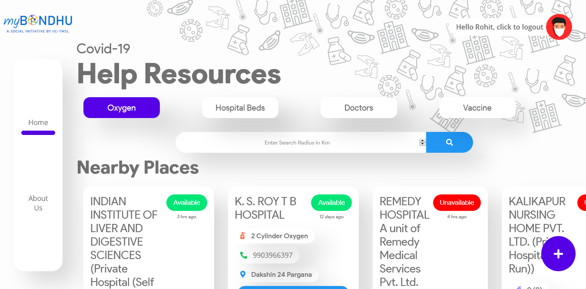
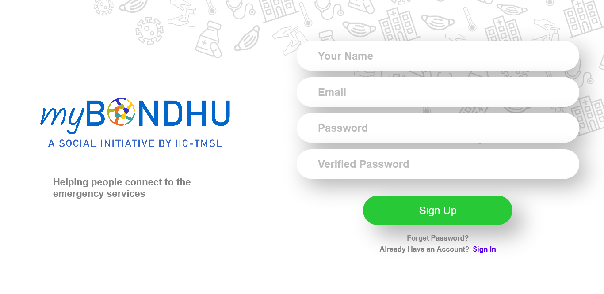
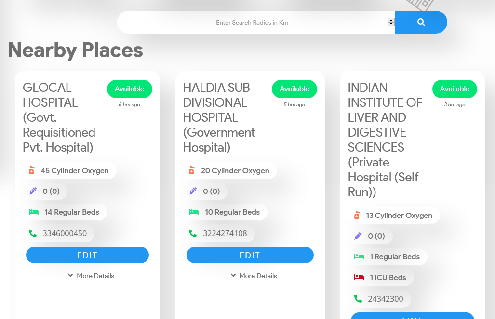
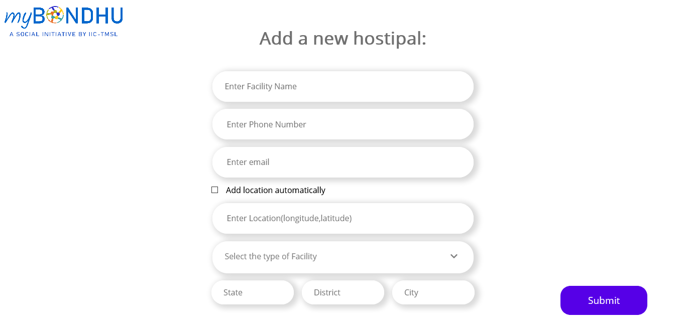

# myBondhu Covid App

This project was bootstrapped with [Create React App](https://github.com/facebook/create-react-app).

### _Are you tired of searching for sources of hospitals having oxygen availability or ICU beds ?_

### Then you have come to the perfect place because this is the one step solution for all your searches.

### Presenting you the [myBondhu App](www.mybondhu.in) where searching for covid resources is as simple as walking in the park.

### You just have to signup with an email and signin with the same.

### Then just type the search radius within which you want to find the hospitals and within seconds you will get all the information you are looking for.

### If you know any location which provide with the Covid Aid resources or you are a member of a hospital using this app then you can add your resource to our portal by clicking on the `+` icon on the homepage and filling out a simple form to save people who are in need.

## Contributors

The work of these and many more people made this app a possibility.

### Our team really wishes the best for you and we hope that you will find the best resources in emergency so, that you don't have to lose a loved one.
